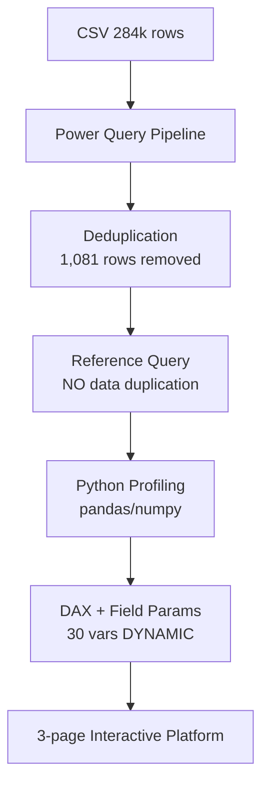

```markdown
# 🏦 Power BI Statistical Profiling Platform: Credit Card Fraud Detection

[](https://powerbi.microsoft.com/)
[](https://learn.microsoft.com/en-us/dax/)
[](https://learn.microsoft.com/en-us/power-bi/connect-data/desktop-python-scripts)

> **🏆 Advanced statistical analysis platform** built entirely in **Power BI Desktop** for **univariate & bivariate exploration** of **284,807 European credit card transactions** (Kaggle, 2013) — **PCA-transformed features V1–V28**, extreme class imbalance (99.83% vs 0.17%).

**Power BI link:** https://app.powerbi.com/groups/me/reports/20522af1-5547-4792-a0a7-04edef1f8d70/0da768d79943273340ac?ctid=fd1df4e5-2eb0-410e-a611-12513030b133&experience=power-bi


---

## 🎯 **Project Mission**

**Beyond dashboards → Statistical analysis platform**: This project transforms Power BI into a **data scientist-grade exploratory environment** combining:

```
✅ RIGOROUS statistical EDA
✅ FULLY dynamic interactivity (Field Parameters)  
✅ SCALABLE data engineering (283k rows)
✅ MULTI-layer analytical architecture
```

## 📊 **3-Layer Analytical Architecture**

| Page | 🎯 Purpose | 🚀 Dynamic Features |
|------|------------|-------------------|
| **📈 Overview** | **Global dataset profile** | 31-column stats table, class donut, quality audit |
| **🔍 Univariate** | **Dynamic single-variable** | Distribution curves + **8 dynamic stats** (Mean/Median/Std/Q1-Q3/Min-Max) |
| **⚖️ Bivariate** | **Variable vs Class** | **Fraud vs Normal**: Mean/Median/Q1/Q3 + distribution comparison |

> **🔥 KEY INNOVATION**: **1 Field Parameter slicer** → controls **ALL 30 numeric variables** across **ALL pages/visuals/measures** simultaneously

---

## 🏦 **Dataset & Preprocessing**

**Source**: [Kaggle Credit Card Fraud Detection](https://www.kaggle.com/datasets/mlg-ulb/creditcardfraud)

| Column | Description | Key Characteristics |
|--------|-------------|-------------------|
| **`V1-V28`** | **PCA components** | Anonymized, decreasing variance V1(1.95)→V28(0.33) |
| **`Time`** | Seconds since first tx | **Bimodal** (2-day recording) |
| **`Amount`** | Transaction € | **Right-skewed** [0-25,000€] |
| **`Class`** | **Target** | **99.83% normal / 0.17% fraud** |

```
📊 RAW:        284,807 rows × 31 cols
🧹 CLEANED:    283,726 rows (-1,081 duplicates = 0.38%)
✅ VALIDATED:  0 nulls across ALL columns
```

---

## 🛠 **Technical Architecture**



## 🚀 **Power BI Advanced Features Mastered**

### **1. 🧹 Data Engineering Pipeline**
```
Power Query → Advanced Editor → Custom M + Python
```
- **Column Quality/Distribution/Profile** → 284k row validation
- **Remove Duplicates** → 1,081 rows eliminated (full column selection)
- **Reference Queries** → Zero data duplication in model

### **2. 🐍 Python in Power Query (10x faster than M)**
```python
import pandas as pd, numpy as np
df = dataset.copy()
# Computes: mean, median, std, Q1, Q3, IQR, mode
# Handles numeric + categorical columns
# Returns profiling table for ALL 31 columns
```

**Lesson**: `Table.Profile()` loses vectorization with custom aggregators → **Python wins**

### **3. 📐 DAX + Field Parameters Architecture**
```dax
-- CORE PATTERN (30+ branches per measure)
dynamic_stat = 
VAR selected_field = MAX('selected_numeric_field'[Field])
RETURN
SWITCH(selected_field,
    "Time",   AVERAGE(creditcard[Time]),
    "Amount", AVERAGE(creditcard[Amount]),
    "V1",     AVERAGE(creditcard[V1]),
    "V2",     AVERAGE(creditcard[V2]),
    -- ... V3→V28
    BLANK()
)
```
**Applied to 8 measures**: `mean`, `median`, `std`, `min`, `max`, `Q1`, `Q3`, `histogram_count`

### **4. 🧩 Dynamic Visualization Solution**
```
❌ PROBLEM: Native histogram can't bind Field Parameter to axis
✅ SOLUTION: Line chart + COUNTROWS() measure = perfect distribution curve
```

---

## 📊 **Dashboard Deep Dive**

### **Page 1: Overview** 
```
┌─ GLOBAL DATA PROFILE ──────────────────────────────┐
│ 📊 31-column statistics table                      │
│ 🥧 Class donut: 99.83% vs 0.17% fraud             │
│ 📈 283,726 rows | 0 nulls | 1,081 duplicates gone │
└────────────────────────────────────────────────────┘
```

### **Page 2: Univariate Analysis**
```
[🔽 Field Parameter Slicer: V1↕️V28, Time, Amount]

DYNAMIC UPDATES → 
├── 📈 Distribution curve (line chart histogram)
├── 🔢 Stat cards: Mean | Median | Std | Min/Max | Q1/Q3
├── 📝 Shape analysis: Normal/Bimodal/Trimodal/Skewed
```

**Key Insights**:
```
Time:     BIMODAL (2-day artifact)
Amount:   RIGHT-SKEWED (<€2k → €25k)
V1,V2,V4: TRIMODAL/NON-NORMAL
V1→V28:   Std decreases 1.95 → 0.33 ✓ PCA ordering
```

### **Page 3: Bivariate Analysis (vs Class)**
```
**🚀 NEW**: Dynamic Fraud(1) vs Normal(0) comparison
┌──────────────┬──────────────┐
│ Normal Group │ Fraud Group  │
│ Mean:   0.00 │ **-1.23**    │
│ Median: 0.00 │ **-0.87**    │
│ Q1:    -0.59 │ **-1.67**    │
│ Q3:     0.65 │ ** 0.45**    │
└──────────────┴──────────────┘
```

---

## 🧠 **Skills Demonstrated** 

| 💼 **Mastery Level** | 📌 **Concrete Implementation** |
|---------------------|-------------------------------|
| **🧹 Data Quality** | Column profiling → **0 nulls** confirmed on 284k rows |
| **🗑️ Scale Handling** | **1,081 duplicates** removed from 284k rows |
| **🔗 Data Modeling** | **Reference queries** → zero data duplication |
| **🧪 M Language** | Custom `let...in` script → full column profiling |
| **🐍 Python BI** | `pandas`/`numpy` → **mean/median/std/Q1-Q3/IQR** |
| **📐 DAX Advanced** | **30-branch SWITCH** → 1 measure serves ALL variables |
| **🔀 Field Params** | **1 slicer** → controls entire analytical platform |
| **🧩 UX Design** | Button navigation + active page indicators |

---

## 💡 **Technical Challenges Conquered**

| ❌ **Challenge** | 🎯 **Root Cause** | ✅ **Solution** | 📈 **Impact** |
|-----------------|------------------|---------------|--------------|
| **`Table.Profile()`**<br/>**extremely slow** | Custom aggregators kill vectorization | **Python script** in Power Query | **10x faster** |
| **Native histogram**<br/>**not dynamic** | Field Param axis binding impossible | Line chart + `COUNTROWS()` DAX | **Fully dynamic** |
| **Static descriptives** | DAX can't auto-switch columns | **30-branch `SWITCH(MAX())`** pattern | **1 measure → 30 vars** |
| **Bivariate groups** | Manual measure per variable | **Dynamic Q1/Q3 DAX** via Field Params | **Rich comparisons** |

---

## 🔍 **Key Statistical Insights**

```
1. Time: BIMODAL → 2-day recording artifact confirmed
2. Amount: RIGHT-SKEWED → most tx < €2k, outliers → €25k  
3. PCA pattern: Std(V1:1.95) > Std(V2:1.65) > ... > Std(V28:0.33) ✓
4. Non-normal: V1,V2,V4,V6,V24,V26 → multimodal/trimodal
5. Fraud vs Normal: **Significant distributional shifts** across most PCA components
```

---

## 🎓 **Business & Technical Value**

```
💼 IMPORTANT TO MENTION:
✅ ADVANCED Power BI (not basic dashboards)
✅ Data engineering at scale (283k rows)  
✅ Statistical rigor (proper EDA)
✅ Python + BI integration
✅ Dynamic architecture mastery

🏢 BUSINESS IMPACT:
✅ Turns Power BI into STATISTICAL platform
✅ Handles imbalanced ML datasets
✅ Production-ready data quality pipeline
✅ Scalable to enterprise volumes
```


